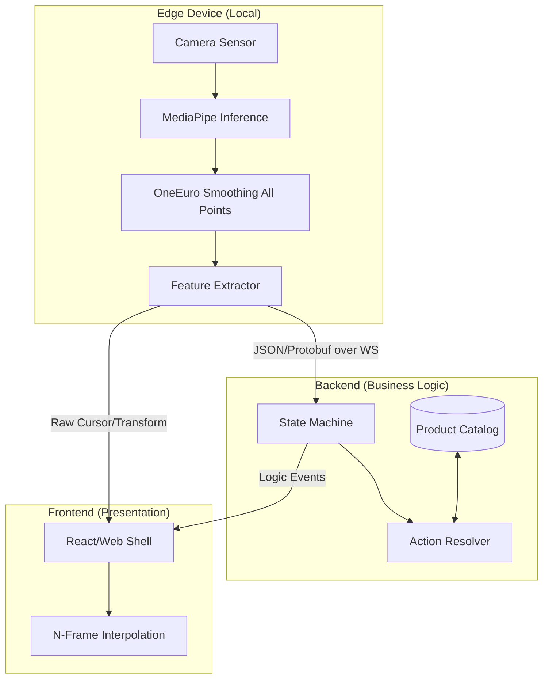

# System Audit: Realtime Camera Interaction

**Role**: Principal Architect + Realtime Systems Reviewer
**Project**: Touchless Interaction System (Virtual Try-on)

---

## 🚩 Critical Issues (Must fix before demo)

### 1. Perception Threading Bottleneck
The `ThreadPoolExecutor(max_workers=1)` combined with `run_in_executor` creates an implicit queue. If frame processing exceeds the inter-frame arrival time (~33ms for 30fps), latency will accumulate rather than maintain realtime state.
> [!WARNING]
> This leads to "drifting delay" where the system gets slower the longer it runs.

### 2. Partial Smoothing & Jitter
`OneEuroFilter` is only applied to the finger cursor. Neck anchors, face rotation, and pinch landmarks are raw data.
> [!CAUTION]
> This causes "visual vibration" (jitter) in virtual items even when the user is stationary.

### 3. Heuristic Collision & Determinism
Gesture detection depends on simple distance/variance thresholds.
- **Pinch**: `distance < 0.04`
- **Hold**: `variance < 0.001`
These are highly sensitive to camera noise and distance from the sensor, lacking a confidence-based or hysteresis-based validation layer.

### 4. Zero-Trust Security Gap
MJPEG streams and WebSockets are exposed without authentication or encryption. Sensitive biometric proximity data is leakable on local networks.

---

## 🏗️ Architectural Smells

### The "Logic Brain" Paradox
The current "entire logic in backend" rule is violated by `state.py` and `gesture.py` running in the same process as the local camera capture. The system currently functions as a Monolithic Edge, not a proper Distributed System.

### Control-Loop Pollution
The primary loop (`process_loop`) mixes sensor ingestion, mathematical extraction, and business state transitions. Any blocking I/O (like a DB query for products) will drop the frame rate of the entire system.

### Static Scaling
Hardcoded screen resolutions (1920x1080) and fixed camera IDs prevent zero-config deployment on various hardware targets (Kiosks, Tablets).

---

## 🚀 Proposed Production Architecture

---

## ⏱️ Latency Budget (Target: < 100ms)

| Component | Est. Latency | Status |
| :--- | :--- | :--- |
| **Capture (Camera)** | 16-32ms | Fixed by hardware |
| **Inference (MediaPipe)** | 20-40ms | Optimization needed (GPU) |
| **Logic & Smoothing** | 2-5ms | Optimal |
| **Network (WS)** | 1-5ms | Good (Localhost) |
| **Presentation (60fps)** | 16ms | Good |
| **Total** | **~60-100ms** | **Marginal for Realtime** |

---

## 📅 Action Plan

### 7-Day Sprint: Stability
- [ ] **Frame Dropping**: Modify `main.py` to discard new frames if the executor is busy.
- [ ] **Full-Point Smoothing**: Apply `OneEuroFilter` to all landmarks used for `TRY_ON`.
- [ ] **Hysteresis**: Add a frame-counter buffer (e.g., must detect pinch for 3 frames) to prevent flicker.

### 14-Day Sprint: decoupling
- [ ] **Logic Migration**: Move `StateMachine` to a dedicated service (NodeJS/Go).
- [ ] **Protocol Design**: Standardize the message schema for Landarmk Transmission.

### 30-Day Sprint: Production Hardening
- [ ] **Security**: Implement JWT/Token handshake for WebSocket connection.
- [ ] **Auto-Calibration**: Add a "Home" state to calibrate user range and screen dimensions.

---

## ⚖️ Final Verdict: **PROCEED (with caution)**
The system is fundamentally sound in its use of MediaPipe and filtering math. However, it is a **Prototype**, not a **Product**. Without decoupling the processing loop and hardening the gesture determinism, it will fail under varied lighting or network conditions.

**Antigravity Audit Team**
*Principal Architect Review*
